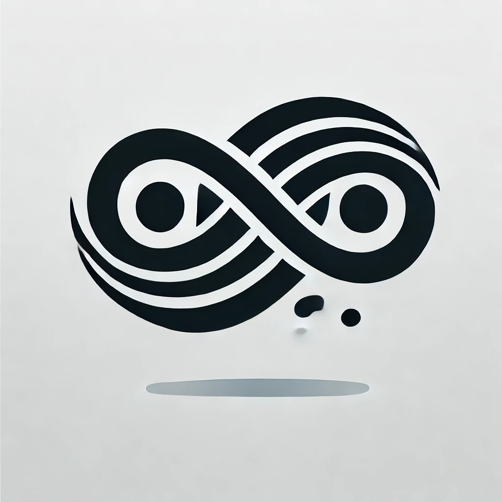
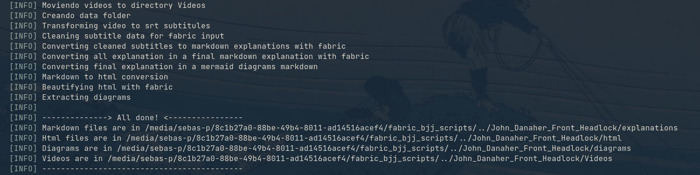

<div align="center">
   
</div>


# Fabric Instructionals for Jiu-Jitsu Content Creation



## Overview

This project is a small contribution to the Brazilian Jiu-Jitsu (BJJ) and programming communities. It’s a work-in-progress tool designed to help BJJ practitioners, teachers, and content creators process instructional videos (MP4 format) into finished guides in Markdown and HTML formats. Whether you’re a grappling coach or just someone with a passion for teaching, this tool aims to make the process a bit easier.

At the heart of this project is the **`fabric_instructionals.sh`** script. Its main purpose is to take instructional MP4 videos and convert them into structured, polished instructional guides ready to share.

---

## Purpose

The main goal is to:

- Help **BJJ enthusiasts and instructors** turn their instructional videos into clear, organized learning materials.
- Offer a **practical, community-driven tool** for bridging the gap between raw media and shareable formats.
- Support the BJJ and tech communities by showing how simple tools can solve everyday challenges.

---

## Why?

Brazilian Jiu-Jitsu instructional videos are often hours long, packed with details about techniques, concepts, and transitions. While these videos are a fantastic resource, they can be overwhelming to study and remember.

- **Lost Details**: It’s easy to forget small but crucial details from an instructional, especially if you watched it weeks or months ago.
- **Time-consuming Review**: Finding a specific part of a technique in a video can be frustrating and time-consuming.
- **Text is Accessible**: Having all the information in text form allows you to quickly reference techniques, study concepts, and revisit specific sections without scrubbing through hours of video.
- **Organization is Key**: This tool organizes all that information into clear chapters, subchapters, and diagrams, making it easier to review and internalize.

By converting these videos into structured guides, this project aims to make studying BJJ more effective and less tedious.

---

## Contribute

We welcome contributions to the project, especially improvements to the **GPT-based patterns**. If you’d like to enhance or optimize the existing patterns, you can contribute by updating the `/patterns` folder.

We also encourage users to share any improved or optimized patterns they develop. Sharing these improvements benefits the entire community and helps make this project even better.

---

## Warning

- This project relies on **GPT-based patterns** to process content, which may sometimes produce inconsistent results. While the tool is designed to automate and simplify tasks, occasional manual adjustments might be necessary.
- **Execution can be slow**: Processing videos, generating subtitles, and structuring guides takes time. Please be patient and allow the script to complete each step before interrupting or closing the process.

---

## Prerequisites

Before using this project, ensure you have the following tools installed and configured:

### Install Fabric

1. Follow the installation instructions provided in the Fabric repository to set it up on your system. You can find the full guide here: [Fabric GitHub Repository](https://github.com/danielmiessler/fabric).

2. Verify the installation:
   
   ```bash
   fabric --version
   ```

### Install Node.js and `npx`

Fabric relies on Node.js and `npx` for some tasks. Follow these steps to install them on Linux:

1. **Update your system package index:**
   
   ```bash
   sudo apt update
   ```

2. **Install Node.js:**
   
   ```bash
   sudo apt install nodejs
   ```

3. **Install npm (Node Package Manager):**
   
   ```bash
   sudo apt install npm
   ```

4. **Verify the installation:**
   
   ```bash
   node -v
   npm -v
   ```

5. **Install `npx`:**
   `npx` is included with npm version 5.2+ and higher. To ensure you have it:
   
   ```bash
   sudo npm install -g npx
   ```

6. **Verify `npx`:**
   
   ```bash
   npx --version
   ```

---

## Usage

### Step 1: Get Started

Clone the repository and navigate to the folder:

```bash
git clone <repository-url>
cd <repository-folder>
```

### Step 2: Install Dependencies

Make sure all required packages from the `package.json` file are installed. Run:

```bash
npm install
```

### Step 3: Copy and Extract Models

After installing the npm packages, execute the next script:

```bash
bash obtener_modelo.sh
```

This ensures the necessary models are available for subtitle generation and processing.

### Step 4: Update Fabric Patterns

Move the patterns from this repository into the Fabric patterns directory and update the patterns list:

```bash
mv -r ./patterns/* ~/.config/fabric/patterns
fabric --updatepatterns
```

This ensures Fabric has access to the custom patterns needed for processing the instructional content.

### Step 5: Make the Scripts Executable

Grant execution permissions to the main script and tools folder:

```bash
chmod +x fabric_instructionals.sh tools/*
```

### Step 6: Prepare Your Video Files

- **Ensure the folder with MP4 files contains only the videos** to avoid unnecessary processing.
- It is **highly recommended** to keep backups of your videos elsewhere, as this tool modifies files during the process, and data could be lost if not handled properly.

### Step 7: Run the Script

Execute the script with the directory containing your MP4 files:

```bash
./fabric_instructionals.sh <relative_path>/directory_with_mp4_files
```

- Replace `<relative_path>/directory_with_mp4_files` with the path to the folder containing your MP4 instructional videos.

---

## Example

Here’s an example of what the tool can generate: a complete instructional guide with Markdown, HTML, and diagrams, all tied to the original video content.


---

## Notes

- This tool is a work in progress, and some manual adjustments might be required to perfect the final output.
- It was created as a side project to combine a love for BJJ and programming, so feel free to tweak and improve it!

---

## License

This project is licensed under the MIT License. You’re free to modify and share it as long as you credit the original contributors.

---
